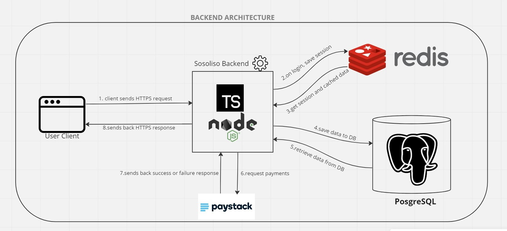
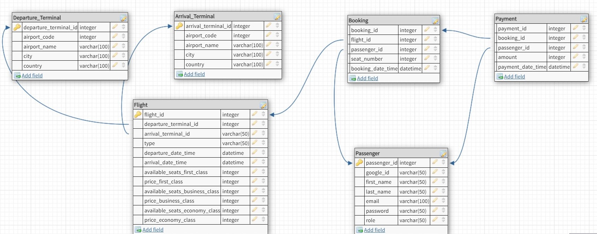

# Sosoliso Airline
A Project given by Grazac.

## Background Context

This is the backend service for Sosoliso Airline. It was developed using NodeJS as the runtime environment, typescript as the language, Redis for session storage and caching, PostgreSQL for data storage and integration of paystack API for payment.

The technologies above were chosen for their awesome benefits they provide. 
NodeJS can be seen as a runtime environment for executing JavaSrcipt outside of a web browser and on the server-side. It has a high performance and enables developers to build scalable applications.

Typescript is a superset of Javascript that adds static typing. When used with Node.js, TypeScript provides a type-safe environment for building scalable and maintainable applications. By leveraging TypeScript's strong typing, developers can catch errors earlier in the development process, resulting in fewer bugs and faster development. It also provides better performance as it is compiled to Javascript.

Redis is an open-source, in-memory data structure store that is commonly used as a database, cache, and message broker.  Redis is a versatile and powerful tool that can be used for a wide variety of use cases, and in this application it was used for session management.

PostgreSQL is a Relational Database Management System (RDMS) that is widely used for enterprise applications. It also has a reputation for being highly secure and is often used in applications that handle sensitive or confidential data.

Paystack is a modern payment gateway that makes it easy for businesses to accept payments online. Paystack provides a platform that allows businesses to accept payments from customers via a variety of payment channels, including cards, bank transfers, and mobile money. It was used in this application as it is easy, it is also reliable, secure, and flexible.

As you can see in the picture above, a client(mobile or web) accesses the application, he or she signup/register to save the credentials in the postgreSQL database and then login, if the credentials are incorrect, it bounces the client and prevents the client from accessing the protected endpoints but if the credentials are correct it creates a session and saves it in the redis server allowing the client to have access to all the endpoints. The client can view all flights details saved in the postgreSQL server and book a flight. If the client decides to book a flight the client has to pay via paystack that is to say the application is consuming paystack API to enable passengers make payment for their booked flights.

## Database Schema

The picture above gives a clear description of the structure of the application model, which are as follows:
The schemas for this application are as follows:
- **Passenger:** represents the structure of passengers information and used to store their information 
- **Flight:** represents the structure of flights details and used to store flight details
- **Departure Terminal:** represents the structure of data relating to details of Daparture Airport
- **Arrival Terminal:** represents the structure of data relating to details of Arrival Airport
- **Booking:** represents the structure of data relating to details of passenger intent to book flights
- **Payment:** represents the structure of data relating to the payments details of the passengers

## Endpoints
The following are the endpoints of this application:
- **GET** *https://sosoliso.herokuapp.com* - application landing page.
- **GET** *https://sosoliso.herokuapp.com/api/v1/auth/flight* - A protected endpoint to enable passengers view all flight information. It is improved with pagination, 5 flights per page.
- **GET** *https://sosoliso.herokuapp.com/api/v1/auth/flight/:flightId* - A protected endpoint to enable passengers view a particular flight details.
- **GET** *https://sosoliso.herokuapp.com/api/v1/flight/:bookingId* - A protected endpoint to enable passengers view their booking details of each flight booked by them.
- **GET** *https://sosoliso.herokuapp.com/api/v1/flight/payment/verify/:bookingId* - A protected endpoint for payment verification, should be accessed after passenger has made payment.
- **GET** *https://sosoliso.herokuapp.com/api/v1/admin/booking/:id* - A protected endpoint for the admin to view a particular booking details of a passenger.
- **GET** *https://sosoliso.herokuapp.com/api/v1/admin/bookings* - A protected endpoint for the admin to view all bookings made in the application.
- **GET** *https://sosoliso.herokuapp.com/api/v1/admin/passengers* - A protected endpoint to enable the admin view all registered passengers information.
- **GET** *https://sosoliso.herokuapp.com/api/v1/admin/cancelled* - A protected endpoint to enable the admin view all cancelled flights in the application.
- **POST** *https://sosoliso.herokuapp.com/api/v1/auth/signup* - An endpoint to enable passenger register.
- **POST** *https://sosoliso.herokuapp.com/api/v1/auth/login* - An endpoint to enable passenger login.
- **POST** *https://sosoliso.herokuapp.com/api/v1/flight/booking/:flightId* - A protected endpoint to enable passengers book a flight.
- **POST** *https://sosoliso.herokuapp.com/api/v1/flight/payment/:bookingId* - A protected endpoint to enable passengers pay for their booked flight.
- **POST** *https://sosoliso.herokuapp.com/api/v1/admin/flight* - A proected endpoint to enable the admin post flight information.
- **PATCH** *https://sosoliso.herokuapp.com/api/v1/flight/booking* - A protected endpoint to enable passengers cancel their booked flight.
- **DELETE** *https://sosoliso.herokuapp.com/api/v1/auth/logout* - An endpoint to destroy session and logout passengers.

## How to use this Application
This API is open source so anyone is allowed to use it with the following steps 😊:
1. You need to have NodeJS installed on your local machine.
2. You need to have postgreSQL also installed on your local machine, or get a cloud instance of postgreSQL.
3. Ensure to clone this repository into your local machine.
4. Install all the dependencies and dev dependencies using `npm install`
5. Now you need to create a database in postgreSQL terminal after successfully logging in to postgreSQL using the following:
```
CREATE DATABASE sosoliso;
```
Or perharps you can use a cloud instance of postgreSQL.
6. Ensure to use the SQL located in `./src/models` to create the various tables needed in this application.
7. Download Redis or get a cloud instance of Redis server.
8. Ensure to register on paystack to enable you get their API keys
9. You need to create a a .env file and ensure to enter the following:
```
PORT=****
DB_HOST=****
DB_USER=****
DB_DATABASE=****
DB_PASSWORD=****
DB_PORT=****
REDIS_HOST=****
REDIS_PORT=****
REDIS_PASSWORD=****
SESSION_SECRET=****
PAYSTACK_SECRET=****
SMTP_PASSWORD=****
SMTP_USER=****
SMTP_HOST=****
```
Note: replace the `*`s with the necessary details.
10. Now you are good for the final step. Run your server using `npm start`.

Enjoy 😊😊😊. Ensure to let me know if you have any issue with this application. I'm always open for corrections as it will enable learn more 😊

## API Documentation
Please click the link below to refer to the postman documentation:
- [documentaion link](https://documenter.getpostman.com/view/25460695/2s93Y6tKGY)

## Author
- Aghogho Daniel Bogare [danbogare@gmail.com](danbogare@gmail.com)
